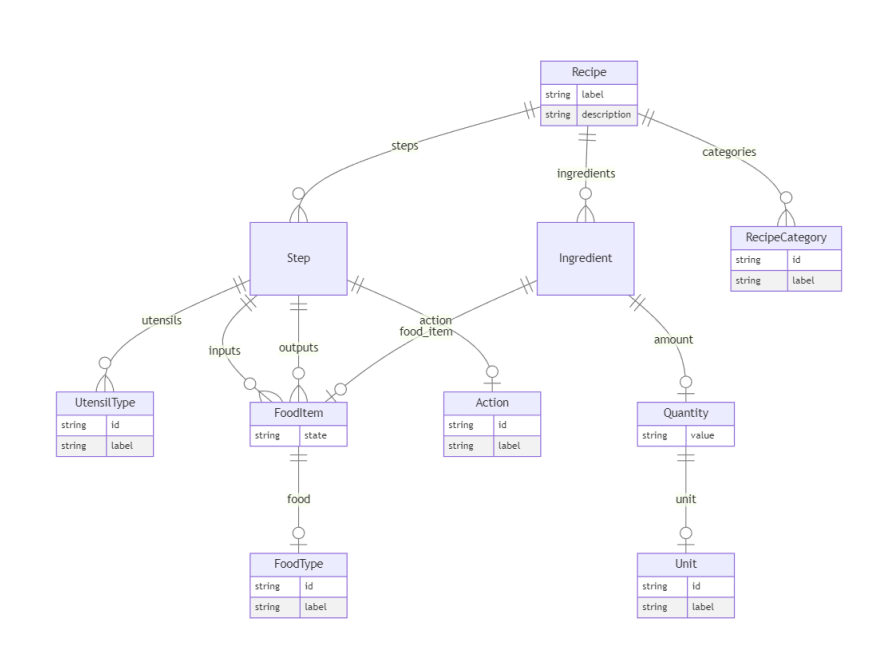
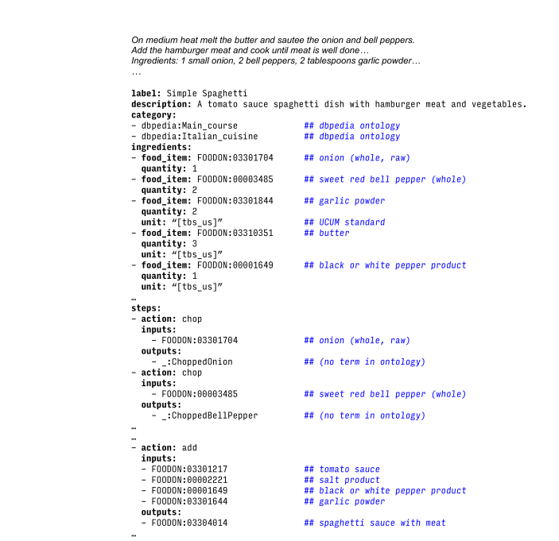
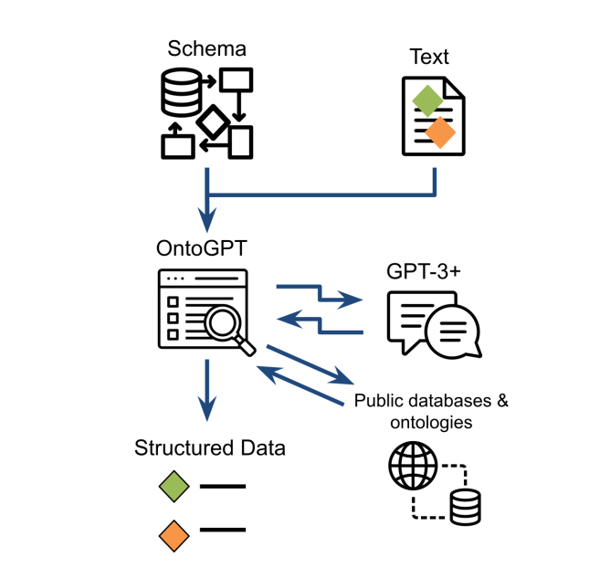
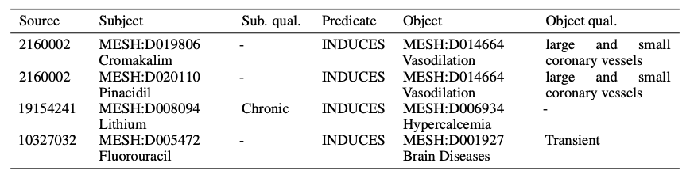

# SPIRES: Structured Prompt Interrogation and Recursive Extraction of Semantics

## What is this paper about?

Imagine you want to build a giant organized database of knowledge — like a detailed encyclopedia that links concepts together (called a **knowledge base** or **ontology**). Normally, human experts have to read lots of papers and manually fill in this database. That's slow and expensive.

This paper introduces **SPIRES**, a system that uses AI (specifically Large Language Models like GPT) to do this job automatically — without needing to train the AI on thousands of examples first.

---

## The Problem It Solves

1. **Building knowledge bases is painful.** Experts have to read papers and manually extract facts — who interacts with what, what causes what, etc.
2. **Existing AI tools need lots of labeled training data.** You have to show the AI hundreds of examples before it understands what to extract.
3. **Existing tools can't handle complex, nested structures.** Real-world knowledge (e.g., a multi-step drug mechanism) is layered — one thing leads to another leads to another. Most tools can't capture that.

---

## What SPIRES Does

SPIRES takes two inputs:
- A **schema** — a blueprint you define that says "I want to extract: drug → targets → gene → disease"
- A **piece of text** — like a scientific paper or article

Then it **repeatedly asks the LLM questions** (prompt interrogation) to fill in each part of the schema, going deeper and deeper (that's the "recursive" part). It also links extracted terms to real IDs from existing databases (like gene databases or disease ontologies), so the output isn't just words — it's structured, linked data.

---

## Key Strengths

- **Zero-shot learning** — no training data needed. You just describe what you want.
- **Handles complex nested schemas** — it can go multiple levels deep.
- **Easy to customize** — define a new schema, point it at text, and go.
- **Grounded outputs** — extracted entities get real database IDs, not just raw text.

---

## How Good Is It?

- Accuracy is in the **mid-range** of existing tools — not the best, but competitive.
- It **far outperforms** what an LLM can do on its own when it comes to linking entities to real identifiers (called "grounding").
- Big advantage: it works **out of the box on new tasks** with no extra training.

---

## Where Was It Tested?

The authors applied SPIRES to extract:
- Food recipes
- Cell signaling pathways (across multiple species)
- Disease treatments
- Multi-step drug mechanisms
- Chemical-to-disease relationships

---

## The Big Idea

Use LLMs not as a black box that gives free-text answers, but as a **structured extraction engine** — guided by a schema you define, validated against real-world databases. This makes LLMs actually useful for scientific knowledge curation.

---

## Code

Available as part of the open-source **OntoGPT** package:
https://github.com/monarch-initiative/ontogpt

---

*Source: SPIRES paper abstract — zero-shot knowledge extraction using LLMs with schema-guided recursive prompting.*

---

## Section 1: Introduction (Plain Language)

### What are Knowledge Bases and why do they matter?

A **Knowledge Base (KB)** is like a super-organized database where facts are stored in a way that computers can reason over and query precisely. Think of it less like a spreadsheet and more like a web of connected facts.

Two flavors:
- **General-purpose KBs** (e.g., Wikidata) — broad knowledge about anything: countries, ingredients, historical events. Used to power websites, search, and cross-domain analysis.
- **Domain-specific KBs** (e.g., Gene Ontology, Reactome) — deep knowledge for a specific field, like how genes interact inside cells. Scientists use these to interpret experiment results.

All KBs have one thing in common: **humans built them**, usually domain experts painstakingly reading papers and entering data.

---

### The gap: most knowledge is trapped in text

Scientific knowledge lives in journal articles and abstracts — written in natural language, which computers have historically struggled to read and understand.

Modern **Large Language Models (LLMs)** like GPT-3/4 are very good at reading technical text and answering questions about it. But they have two well-known problems:
- **Hallucinations** — they sometimes confidently make up facts that aren't true.
- **Insensitivity to negations** — they can miss or misread statements like "X does NOT cause Y."

So you can't just trust an LLM's raw output to fill a knowledge base — you'd be inserting wrong facts.

---

### The smarter approach: use LLMs to assist curation, not replace it

Instead of asking an LLM to directly answer and then trust it blindly, you can use LLMs as one step in a pipeline that still validates facts against real databases before anything gets stored.

NLP can help at multiple stages of KB construction:
| Stage | What it does |
|---|---|
| **Literature triage** | Picks which papers are even worth reading |
| **Named Entity Recognition (NER)** | Finds mentions of relevant things (genes, ingredients, diseases) in text |
| **Grounding** | Maps those text mentions to real IDs in databases (e.g., "insulin" → DB:P01308) |
| **Relation Extraction (RE)** | Connects entities with relationships (e.g., "Drug X *causes* Disease Y") |

The latest LLMs can do all of these in **zero-shot** or **few-shot** mode — meaning you don't have to train them with hundreds of labeled examples. You just describe the task in a prompt.

---

### The hard part: complex, nested schemas

Most real KBs aren't just flat lists of triples like "A causes B." They have **nested schemas** — structured blueprints that describe how data should look.

**Example — a recipe schema:**
- A Recipe has a list of Steps
- Each Step has: an Action, Utensils, Inputs, and Outputs
- Each Input/Output is a tuple of: a Food Type + a State (e.g., "potato, raw" or "potato, boiled")
- Each food type maps to an ID in a food ontology (FOODON)

**Example — a biological pathway schema:**
- A Pathway has Subprocesses
- Each Subprocess has Steps
- Each Step has: an Action, a Subcellular Location, Inputs/Outputs with activation states and stoichiometry

Filling out these layered structures automatically is hard. Existing NLP pipelines need a lot of custom engineering every time you want to handle a new schema.

---

### What SPIRES does differently

SPIRES is designed to fill in any such schema automatically, given just:
1. A **schema definition** (you describe what you want to extract)
2. An **input text** (the paper or article to extract from)

It works by **recursively prompting the LLM** — asking about each field in the schema, and if a field contains another complex object, going deeper and prompting about that too.

For entity grounding (mapping words to real database IDs), SPIRES uses **external ontology tools** — over 1,000 ontologies from the OntoPortal Alliance, plus tools like Gilda and OGER — rather than trusting the LLM to recall IDs from memory (which it's bad at). This produces far more reliable, consistent mappings.

---

### Why this matters

SPIRES is the first approach that can:
- Handle **arbitrarily nested schemas** without custom engineering per schema
- Do this **without any training data** (zero-shot)
- **Ground extracted entities** to real database IDs reliably, not just return raw text

It turns an LLM from a free-text answering machine into a structured, schema-aware extraction engine — the missing piece for automating knowledge base construction.

---

## Section 2: System and Methods (Plain Language)

### What is a Schema?

A **schema** is like a form or template that tells you what information to collect and how to organize it.

Think of it like a job application form:
- It has specific fields (name, experience, skills)
- Some fields accept free text, some only accept specific values (e.g., "Full-time" or "Part-time")
- Some fields can have multiple answers (multivalued), some only one

In SPIRES, a schema defines exactly what information should be extracted from text — the shape of the data.

**Figure 1 — Example Schema (Recipe)**



> The diagram shows a Recipe at the top. It breaks down into Steps, Ingredients, and Categories. Steps further break into Utensils, FoodItems (inputs/outputs), and Actions. Ingredients break into FoodItems and Quantities. Every leaf node (like FoodType or Unit) has an `id` (a real database identifier) and a `label` (a human-readable name). The "crows feet" symbols on arrows mean "multiple values allowed."

---

### Key Concepts in a Schema

Every schema is made of **classes** (types of things) and **attributes** (properties of those things).

| Concept | What it means | Example |
|---|---|---|
| **Class** | A category of thing | `Recipe`, `Ingredient`, `Step` |
| **Attribute** | A property of that class | `label`, `steps`, `ingredients` |
| **Range** | What type of value an attribute holds | string, number, another class, or a fixed list |
| **Multivalued** | Can it hold multiple values? | A recipe has many steps (yes); one name (no) |
| **Identifier** | Is this a persistent database ID? | `FOODON:03301704` for "onion" |
| **Prompt** | Custom instruction to the LLM for this field | "List only the cooking actions" |
| **Inlined** | Is the sub-object embedded or referenced? | Steps are embedded inside a Recipe |
| **ID Spaces** | What ID prefixes are allowed? | `FOODON`, `MESH`, `GO`, `WIKIDATA` |

---

### What does an extracted result look like?

**Figure 2 — Example text → structured YAML output**



> Given a few lines of recipe text ("On medium heat melt the butter and sauté the onion..."), SPIRES produces a structured YAML object. Each ingredient is mapped to a FOODON ontology ID (e.g., `FOODON:03301704` = onion, whole, raw). Each step lists its action, inputs, and outputs. Where no ontology term exists, a placeholder blank node is used (e.g., `_:ChoppedOnion`). Human-readable labels appear as comments in blue.

This output isn't just text — it's **machine-readable linked data** that can be loaded directly into a knowledge base.

---

### How does SPIRES work overall?

**Figure 3 — The SPIRES pipeline**



> The pipeline: a **Schema** + **Text** go into **OntoGPT**. OntoGPT sends prompts to **GPT-3+** (via OpenAI API) and gets answers back. Those answers are then **grounded** against public databases and ontologies (over 1,000 of them). The final output is **Structured Data** — instances and relationships that match the schema exactly.

The key insight: the LLM handles language understanding; external databases handle reliable ID lookup. Neither does the other's job.

---

### Why use external ontologies for grounding?

When you ask an LLM "what's the database ID for onion?", it will often guess or hallucinate a wrong ID. Instead, SPIRES takes the LLM's text answer ("onion") and looks it up in real ontology databases (like FOODON, MeSH, Gene Ontology) using tools like **Gilda** and **OGER**. This gives far more accurate and consistent identifiers.

SPIRES can draw from over **1,000 ontologies** in the OntoPortal Alliance — covering biology, chemistry, food, medicine, and more.

---

## Section 2.1: Evaluation of Entity Grounding (Plain Language)

### What is "entity grounding"?

When you extract "onion" from text, you need to map it to a real, unique database ID like `FOODON:03301704`. That mapping — text → ID — is called **grounding**. Getting this right consistently is crucial for a knowledge base to be useful.

### The question being tested

> Does SPIRES give better, more accurate IDs than just asking the LLM directly?

### How the experiment was set up

- Picked **100 random terms** from each of 3 ontologies:
  - **Gene Ontology (GO)** — terms about biological processes and molecular functions
  - **EMAPA** — terms about mouse developmental anatomy
  - **MONDO** — terms about diseases

- Queried **two GPT models**:
  - GPT-3.5-turbo (16k context version)
  - GPT-4-turbo

- Each model was tested **two ways**:
  1. **Raw LLM** — just ask the model to return the correct ID for each term label
  2. **SPIRES** — use a minimal schema and the grounding pipeline (external ontology lookup)

### What counts as a correct match?

A grounding was considered successful only if all three conditions were met:
1. The label was parsed as a **single entity** (not split or garbled)
2. The label text was **unchanged** in the output
3. It was mapped to the **correct identifier**

### Why this matters

LLMs are trained on text, not databases. They often "hallucinate" IDs — confidently returning a plausible-looking but wrong or non-existent identifier. SPIRES sidesteps this by using the LLM only to identify the term in text, then doing the actual ID lookup against real ontology databases. This section quantifies exactly how much better that approach is.

---

## Section 2.2: Evaluation Against Chemical-Disease Relation Task (Plain Language)

### What is this evaluation?

This is a **benchmark test** — a well-known, standardized challenge used by the NLP community to compare how good different systems are at extracting relationships between chemicals and diseases from scientific text.

The benchmark is called **BC5CDR** (BioCreative V Chemical-Disease Relation task).

### The task in simple terms

Given a scientific abstract, find all statements of the form:

> **Chemical X** → *induces* → **Disease Y**

For example: "Aspirin causes stomach bleeding" → `(Aspirin, induces, Stomach bleeding)`

Both X and Y must be mapped to real **MeSH IDs** (Medical Subject Headings — a standard medical vocabulary).

### What data was used

- **500 abstracts** from the BC5CDR test set
- **1,066 known chemical→disease triples** to check against
- The training set was used only to build a better lookup dictionary (lexicon) for name→MeSH ID mapping — then discarded. No fine-tuning of the LLM was done.

### How grounding worked

Finding the MeSH ID for a chemical is hard because the same chemical appears under different names across databases. SPIRES used multiple databases in parallel:

| Database | What it covers |
|---|---|
| MeSH | Medical terms (the target vocabulary) |
| ChEBI | Chemical compounds |
| DrugBank | Drugs and drug targets |
| MedDRA | Medical terminology for adverse drug events |

All IDs were then **normalized to MeSH** using a tool called the Translator NodeNormalizer, so results could be fairly compared to the benchmark answers.

### The schema used

SPIRES was given a schema based on the **Biolink Model** — a standard way of representing biomedical knowledge. Biolink supports richer triples that include extra qualifiers (e.g., "does NOT cause"), not just simple subject→predicate→object.

For this evaluation:
- Subject/object qualifiers were ignored (not tested in the original benchmark)
- Triples with a **"NOT" qualifier** (e.g., "does not cause") were discarded — only positive relations counted

### Two processing strategies compared

| Strategy | What it does |
|---|---|
| **Chunking** | Splits each abstract into smaller overlapping segments, processes each separately (sliding window) |
| **No chunking** | Sends the full title + abstract in one prompt |

### Models tested

- **GPT-3.5-turbo**
- **GPT-4**

Both tested with and without chunking, with no fine-tuning — pure zero-shot extraction.

---

## Section 3: Algorithm (Plain Language)

### What does SPIRES take as input and produce as output?

**Inputs:**
1. **Schema (S)** — the blueprint describing what to extract and how to structure it
2. **Entry point class (C)** — which class in the schema to start from (e.g., start at `Recipe`, not `Step`)
3. **Text (T)** — the article or passage to extract from

**Output:**
- A fully structured **instance** — a filled-in object that conforms to the schema, with real ontology IDs

---

**Figure 4 — SPIRES Algorithm Flowchart**


> Schema and Text feed into **Generate Prompt**. The prompt goes to the LLM (**Complete Prompt**), which returns a completion payload. That's parsed (**Parse Completion**) into a partial instance, then **Grounded** against ontologies. At this point a decision is made: are there **additional non-terminals** (nested classes still to fill)? If yes, loop back to Generate Prompt for the next nested level. If no, optionally **Translate to OWL**, then optionally **Reason** over the result. The brown box at the bottom is the final output.

### The 5 steps of SPIRES

```
SPIRES(S, C, T):
  1. GeneratePrompt(S, C, T)    → build a prompt for the LLM
  2. CompletePrompt(p)          → ask the LLM, get a response
  3. ParseCompletion(r, S, C)   → parse the response, recurse into nested classes
  4. Ground(iu, S, C)           → map text mentions to real ontology IDs
  5. TranslateToOWL(i)          → (optional) convert to OWL ontology format
```

#### Step 1 — Generate the Prompt
Build a question for the LLM based on the schema and the input text. The prompt describes what fields to fill in and what format to return them in.

#### Step 2 — Complete the Prompt
Send the prompt to an LLM (GPT-3, GPT-4, etc.) and get a raw text response back.

#### Step 3 — Parse and Recurse
Parse the LLM's response into a structured object. If any field's value is itself a complex class (e.g., a `Step` inside a `Recipe`), SPIRES **calls itself recursively** on that nested part — going deeper until all fields are filled.

This recursion is what makes SPIRES able to handle deeply nested schemas that other tools can't.

#### Step 4 — Ground
The parsed object at this point has text labels (e.g., "onion") but not yet real IDs. The grounding step looks up each entity in external ontologies and databases to replace labels with stable identifiers (e.g., `FOODON:03301704`).

#### Step 5 — Translate to OWL (optional)
OWL (Web Ontology Language) is a formal standard for representing knowledge that machines can reason over. SPIRES can optionally export the extracted instance into OWL format for use in ontology tools.

---

### Section 3.1: Step 1 — Generate Prompt (Plain Language)

The first thing SPIRES does is **build a prompt** to send to the LLM. The prompt is assembled from 4 parts glued together:

```
GeneratePrompt = Instructions() + AttributeTemplate(S, C, T) + TextIntro() + T + Break()
```

| Part | What it produces | Example |
|---|---|---|
| **Instructions()** | A fixed opening instruction | `"From the text below, extract the following entities in the following format"` |
| **AttributeTemplate(S, C, T)** | A YAML-like form listing each field to fill in | `food_item: <the food item>` |
| **TextIntro()** | A fixed separator | `"Text:"` |
| **T** | The actual input text to extract from | `"garlic powder (2 tablespoons)"` |
| **Break()** | A fixed end marker | `"==="` |

#### How AttributeTemplate works

For each attribute in the schema class, it writes one line:

```
<attribute name> : <prompt for that attribute>
```

Two special rules:
- If **no custom prompt** is defined for an attribute, SPIRES auto-generates one from the attribute's name
- If the attribute is **multivalued** (can hold a list), the line is prefixed with `"A semicolon-separated list"`

#### Concrete example

Schema = RecipeSchema, Class = Ingredient, Text = `"garlic powder (2 tablespoons)"`

```
Split the following piece of text into fields in the following format:

food_item: <the food item>
amount: <the quantity of the ingredient>

Text:
garlic powder (2 tablespoons)
===
```

The LLM sees this and knows exactly what fields to fill in and what format to return them in.

> **Note:** When SPIRES recurses into a nested class, the input text T gets smaller — it's only the relevant sub-text for that nested level, not the full document.

### Section 3.2: Step 2 — Complete the Prompt (Plain Language)

This step is the simplest: **send the prompt to the LLM and get a response back.**

SPIRES calls the LLM's completion API — meaning it hands the prompt to the model and asks it to "complete" or fill in what comes next.

#### What model is used?

- Default is **GPT-3.5-turbo** (via OpenAI API)
- Works with any model that can follow a structured prompt and return output in the requested format

#### What does the response look like?

The LLM returns a pseudo-YAML structure that mirrors the template from Step 1. For the garlic powder example:

**Prompt sent (from Step 1):**
```
food_item: <the food item>
amount: <the quantity of the ingredient>

Text:
garlic powder (2 tablespoons)
===
```

**LLM response (completion payload):**
```
food_item: garlic powder
amount: 2 tablespoons
```

The model simply fills in the blanks — it replaces the `<placeholder>` descriptions with actual values extracted from the text. This structured response is what Step 3 (ParseCompletion) will process next.

### Section 3.3: Step 3 — Parsing and Recursive Extraction (Plain Language)

This is the most important step — where SPIRES actually **reads the LLM's response and goes deeper** into nested structures.

It has two sub-steps:
1. Parse the pseudo-YAML response into field→value pairs
2. Recursively call SPIRES on any fields that are themselves complex objects

---

#### Sub-step 1: Parsing the LLM response

The LLM's output isn't guaranteed to be perfect YAML — it might have inconsistent spacing, capitalization, or slight formatting drift. So SPIRES uses a **forgiving heuristic parser**:

1. Split the response by newlines → get a list of lines
2. For each line, split on the **first `:`** → left side = attribute name, right side = value
3. Match the attribute name **case-insensitively**, and normalize spaces to underscores
4. If the attribute is **multivalued**, split the value on `;` to get a list, then process each item

---

#### Sub-step 2: Deciding what to do with each value

Once a field and its value are identified, SPIRES applies one of three rules:

| Rule | When it applies | What happens |
|---|---|---|
| **Rule 1** | Value is a primitive (string, number, boolean) | Return it as-is |
| **Rule 2** | Value is a reference to an ontology class (non-inlined) | Send to **grounding** (Step 4) to get a real database ID |
| **Rule 3** | Value is an **inlined class** (a nested complex object) | Call **SPIRES recursively** on that value |

---

#### Concrete example (continuing from Step 2)

LLM returned:
```
food_item: garlic powder
amount: 2 tablespoons
```

- `food_item` → its range is an ontology class reference → **Rule 2**: ground "garlic powder" against FOODON to get `FOODON:03301844`
- `amount` → its range is an inlined class `Quantity` → **Rule 3**: call SPIRES again with:
  ```
  SPIRES(RecipeSchema, Quantity, "2 tablespoons")
  ```
  This generates a new prompt asking the LLM to split "2 tablespoons" into `value: 2` and `unit: tablespoon`, then grounds the unit to a UCUM identifier.

This recursion keeps going until every leaf value is either a primitive or a grounded ontology ID.

### Section 3.4: Step 4 — Grounding and Normalization (Plain Language)

After parsing, every leaf value that refers to a named entity (a thing in the real world — a chemical, gene, food, disease) is just a text string like `"garlic powder"`. Grounding **converts that string into a stable, unique database ID**.

#### How grounding works

Each schema class can be annotated with one or more **vocabularies** (identified by a prefix like `FOODON`, `WIKIDATA`, `MESH`). SPIRES uses these to know which databases to search.

**Example:** The `FoodItem` class is annotated with `FOODON` and `Wikidata`. When SPIRES encounters `"garlic powder"`, it queries:
- **BioPortal / AgroPortal** → returns `FOODON:03301844`
- **Wikidata normalizer** → returns `WIKIDATA:Q10716334`

Both are valid groundings for the same entity in different vocabularies.

#### Validation after grounding

Once an ID is found, SPIRES checks it against two constraints defined in the schema:

| Constraint | What it checks |
|---|---|
| **IDSpaces(c)** | Is the ID's prefix in the allowed list? (e.g., only `FOODON` allowed, not `WIKIDATA`) |
| **ValueSets(c)** | Is the specific ID present in the allowed set of values? |

If the ID fails either check, it's rejected. This prevents hallucinated or out-of-scope IDs from slipping through.

---

### Section 3.5: Step 5 — Translation to OWL and Reasoning (Plain Language)

After grounding, SPIRES has a fully filled-in **instance tree** — a nested object where every field has either a primitive value or a real ontology ID. This can be directly saved as **JSON or YAML**, which is often enough.

But for advanced use cases, the instance can be converted to **OWL** (Web Ontology Language) — a formal, machine-readable format that allows:
- **Consistency checking** — does this extracted knowledge contradict anything already known?
- **Axiom inference** — can new facts be derived from what was extracted?

#### Tools for converting to OWL

| Tool | What it is |
|---|---|
| **ROBOT templates** | Spreadsheet-based OWL generation tool |
| **DOSDPs** | Dead Simple OWL Design Patterns — templated OWL patterns |
| **OTTR** | Reasonable Ontology Templates — a formal template language for OWL |

> This step is optional — most users stop at the JSON/YAML output. OWL conversion is for teams that maintain formal ontologies and need to run reasoners over the extracted data.

### The core idea in one sentence

SPIRES is a recursive loop: ask the LLM about each field → parse the answer → if the answer is itself a complex object, go deeper → once all fields are filled, look up real IDs from databases.

---

## Section 4: Implementation (Plain Language)

### Where does the code live?

SPIRES is implemented in **Python** as part of the open-source **OntoGPT** package. It ships with:
- A **command line interface (CLI)** — run extraction from your terminal
- A **simple web app** — a UI for those who don't want to use the command line

---

### How are schemas defined?

SPIRES uses **LinkML** (Linked data Modeling Language) as its schema language. Think of LinkML as a powerful way to write "what shape should my data be?" — more expressive than a plain JSON schema.

Key LinkML features SPIRES relies on:

| Feature | What it enables |
|---|---|
| **Static value sets** | Fixed list of allowed values (e.g., days of the week) |
| **Dynamic value sets** | Declarative queries like: *"include branches A, B, C from ontology O1, exclude sub-branch D, plus all of O2"* |
| **Schema conversion** | Import schemas from SHACL, JSON-Schema, or SQL DDL and use them directly with SPIRES |

---

### How does grounding work in practice?

Grounding is handled by **OAKlib** (Ontology Access Kit), a Python library that provides a unified interface to many different annotation and normalization services:

| Tool | What it does |
|---|---|
| **Gilda** | Entity normalization — maps text spans to ontology terms |
| **BioPortal annotator** | Queries BioPortal's index of 1,000+ biomedical ontologies |
| **Ontology Lookup Service (OLS)** | EBI's ontology search service |
| **NCATS Translator Node Normalizer** | Default ID normalizer — maps across databases to a canonical ID |
| **OntoPortal mappings** | Cross-ontology term mappings |

---

### Pre-made schemas (Table 1)

The authors ship ready-to-use schemas for common extraction tasks:

| Schema | Use Case | Ontologies Used | Input Text Type |
|---|---|---|---|
| **Food Recipes** | Enforcing consistent structure on stepwise processes | FOODON, UO | Unstructured and semi-structured recipes |
| **Drug Mechanisms** | Integrating drug descriptions | MONDO, ChEBI, MESH | Mechanism of Action (MOA) descriptions |
| **Chemical-Disease Interactions** | Assembling knowledge graphs of chemical-impacted phenotypes | MESH only | Abstracts describing effects of chemicals on conditions |
| **Metagenomic Samples** | Standardizing metadata for metagenomics | ENVO | Descriptions of environmental samples |
| **Mendelian Diseases** | Extracting disease relationships from literature | MONDO, HPO | Case studies or descriptions of Mendelian diseases |

> Note: The Chemical-Disease schema deliberately restricts grounding to **MeSH only** so it can be fairly evaluated against the BC5CDR benchmark (which uses MeSH IDs).

---

### Optional: OWL reasoning pipeline

After extraction, the results can optionally flow into a formal reasoning pipeline:

```
Extracted instance (JSON/YAML)
  → LinkML-OWL        (converts instance to OWL representation)
  → ROBOT             (runs OWL reasoner)
  → checks for logical inconsistencies + automated classification
```

This is useful for teams that maintain formal ontologies and need to verify that newly extracted knowledge doesn't contradict existing axioms.

---

## Section 4.1: Standard Templates for Multiple Applications (Plain Language)

SPIRES ships with a growing library of **ready-made schemas** so you don't have to write one from scratch for common tasks.

Most schemas are **life-science focused**, for example:
- Deriving a biological pathway from a Mechanism of Action (MOA) description in DrugBank
- Extracting disease-gene relationships from literature

A **food recipes schema** is also included to show that SPIRES isn't limited to biology — it works in any domain where structured extraction from text is useful.

The full list of pre-made schemas is in **Table 1** above (Section 4).

---

## Section 4.2: Extraction of Recipe Ontologies from Websites (Plain Language)

This section demonstrates SPIRES working in a **full end-to-end pipeline** — from raw website text all the way to a reasoned OWL ontology.

### The pipeline, step by step

```
Recipe websites
  → recipe-scrapers (Python)     scrape and extract raw recipe text
  → OntoGPT / SPIRES             extract structured recipe instances using the recipe schema
  → LinkML-OWL                   convert each recipe into OWL axioms
                                  (each recipe = a class defined by its ingredients + steps)
  → ROBOT                        extract relevant parts of FOODON ontology,
                                  merge with extracted recipes
  → manually coded classifications  add high-level groupings:
                                    e.g. "Meat Recipe", "Wheat Based Recipe"
  → ELK reasoner                 automatically classify all recipes
                                  into the right groups based on their ingredients
```

### What makes this impressive

- No manual labeling — recipes are pulled directly from websites
- The reasoner **automatically figures out** which category a recipe belongs to based on its ingredients — you don't hard-code "this recipe is a meat recipe", the reasoner infers it from the fact that it contains meat
- The output is a proper OWL ontology you can query, browse, and reason over

---

## Section 4.3: Entity Grounding Results (Plain Language)

This section shows the numbers behind the grounding comparison — SPIRES vs. asking the LLM directly.

### The test

Ask both approaches: *"What is the database ID for this term?"* across 100 random terms from each of 3 ontologies.

### Results table

| Ontology | SPIRES + GPT-3.5 | SPIRES + GPT-4 | Raw GPT-3.5 | Raw GPT-4 |
|---|---|---|---|---|
| **Gene Ontology (GO)** | 98 / 100 ✓ | 97 / 100 ✓ | 3 / 100 ✗ | 0 / 100 ✗ (refused) |
| **EMAPA** (mouse anatomy) | 100 / 100 ✓ | 100 / 100 ✓ | ~0 / 100 ✗ (wrong ontology) | 0 / 100 ✗ (refused) |
| **MONDO** (diseases) | 97 / 100 ✓ | 18 / 100 ✗ | ~1 / 100 ✗ | ~1 / 100 ✗ |

### What went wrong with raw LLM grounding?

**GPT-3.5-turbo without SPIRES (GO terms):**
- Returned 100 answers — but almost all had wrong IDs
- Called "**mass hallucination**": it confidently invented plausible-looking but incorrect identifiers
- Likely caused by prompting with term names alone, with no surrounding context

**GPT-4-turbo without SPIRES (GO and EMAPA):**
- Consistently **refused to answer**, responding with things like: *"As an AI developed before 2023, I do not have real-time access to databases..."*
- GPT-4 is more cautious about hallucinating — but its solution (refusing) is equally useless

**GPT-3.5 without SPIRES (EMAPA):**
- Didn't refuse, but returned IDs from the **wrong ontology** (EHDAA2 — human anatomy instead of mouse anatomy)

**SPIRES + GPT-4 on MONDO:**
- Surprising failure: only 18/100 correct despite GPT-4 being the stronger model
- Likely cause: GPT-4 parsed complex term names incorrectly (e.g., *"UV-induced skin damage, susceptibility to"* was parsed as just *"skin damage"*)
- Entity parsing errors upstream caused grounding to fail downstream

### Key takeaway

SPIRES with external ontology lookup achieves **97–100% grounding accuracy** across most ontologies. Raw LLM querying achieves **0–3%** — and often either hallucinates or refuses entirely. The grounding pipeline is not optional; it's what makes SPIRES usable.

---

### Table 2: Example Extracted Relations



All relations have the predicate **INDUCES**. Sources are PubMed paper IDs (PMIDs):

| Chemical (Subject) | Predicate | Disease (Object) | Qualifier |
|---|---|---|---|
| Cromakalim (`MESH:D019806`) | INDUCES | Vasodilation (`MESH:D014664`) | large and small coronary vessels |
| Pinacidil (`MESH:D020110`) | INDUCES | Vasodilation (`MESH:D014664`) | large and small coronary vessels |
| Lithium (`MESH:D008094`) | INDUCES | Hypercalcemia (`MESH:D006934`) | Chronic (subject qualifier) |
| Fluorouracil (`MESH:D005472`) | INDUCES | Brain Diseases (`MESH:D001927`) | Transient (object qualifier) |

> This table shows that SPIRES extracts not just the core triple (chemical → induces → disease) but also **qualifiers** — whether the effect is chronic, transient, or limited to specific anatomical sites. These qualifiers come from the Biolink model schema used for this task.

---

## Section 4.4: Evaluation on BC5CDR Task (Plain Language)

### Setup reminder

- **Task:** Extract (Chemical → INDUCES → Disease) triples from 500 biomedical abstracts
- **No fine-tuning:** The training set was only used to build a name→MeSH lookup dictionary, then discarded
- **Schema:** Biolink-based CTD schema — extracts richer triples with qualifiers (e.g., "chronic", "transient", "large coronary vessels")

### A nuance about qualifiers

SPIRES extracts more detail than the benchmark tests for. For example, Table 2's Cromakalim→Vasodilation triple includes the qualifier *"large and small coronary vessels"* — SPIRES got this right, but the benchmark didn't test for it.

Additionally, some correct extractions were **counted as false negatives** because they weren't in the benchmark's answer set — likely omission errors in the original annotation, not SPIRES mistakes.

When evaluating: qualifiers are stripped out (benchmark doesn't test them), and any "NOT" triples are discarded.

---

### Results

| Approach | Model | F-score | Precision | Recall |
|---|---|---|---|---|
| **Chunking** | GPT-3.5-turbo | 41.16 | 0.43 | 0.39 |
| **No chunking** | GPT-3.5-turbo | 36.64 | 0.63 | 0.26 |
| **No chunking** | GPT-4 | 43.80 | 0.69 | 0.32 |

**Reading the trade-off:**
- Chunking → higher recall (finds more), lower precision (more false positives)
- No chunking → higher precision (more selective), lower recall (misses more)
- GPT-4 beats GPT-3.5 on F-score by improving precision significantly

---

### How does SPIRES compare to other systems?

| System | F-score | Training used? |
|---|---|---|
| **SPIRES (best)** | 43.80 | No task-specific training |
| **BC5CDR average** (18 teams) | ~45 | Yes — full training set |
| **BioGPT** (Luo et al.) | 44.98 | Yes — trained from scratch on biomedical text |
| **Best CDR result** | 57.00 | Yes — large, carefully engineered training set |

### The key point

SPIRES sits **just below the average** of 18 competition teams — all of whom used the full labeled training set. SPIRES used **none of it**. This is a strong result for a zero-shot approach.

The gap to the top system (57 F-score) exists because that model was trained on a large, carefully curated dataset. SPIRES could likely close that gap with fine-tuned or domain-specific LLMs — but the point is it doesn't *need* them to be competitive.

---

## Section 5: Discussion

### Section 5.1: Comparable Methods (Plain Language)

This section situates SPIRES among related approaches — what others have tried, and where SPIRES differs.

#### What makes SPIRES distinct

SPIRES is designed to be:
- **Model-agnostic** — works with any LLM that can follow structured prompts
- **Schema-driven** — extraction is guided by a user-defined, arbitrarily complex schema
- **Ontology-grounded** — extracted entities are linked to real database IDs via external lookup, not LLM memory

#### Related work and how it compares

| Approach | What it does | Key difference from SPIRES |
|---|---|---|
| **Dunn & Dagdelen et al.** (GPT-3 fine-tuned) | Uses engineered schemas to extract structured relationships from materials chemistry text | Requires **fine-tuning** on task-specific data; SPIRES needs none |
| **LLMs4OL** | Explored applying LLMs to ontology learning and information extraction | Concluded LLMs are **not yet flexible enough** for ontology-driven needs — SPIRES addresses this gap |
| **Ontology alignment with LLMs** | Using LLMs to match terms across different ontologies | Related to grounding; LLMs have shown improved accuracy here |
| **Agent-OM** | General framework for ontology matching using agents | Could further improve the grounding step that SPIRES relies on |

#### The broader point

The field is converging on the idea that LLMs + structured schemas + external ontologies is the right combination for knowledge extraction. SPIRES is among the first to combine all three in a general, zero-shot framework. Related work either lacks the schema flexibility, requires training data, or hasn't solved the grounding problem robustly.

---

### Section 5.2: Choosing a Model (Plain Language)

SPIRES isn't locked to one LLM — OntoGPT supports both the OpenAI API and select open-source models. This section discusses the trade-offs.

#### Problems with using OpenAI models at scale

| Issue | Details |
|---|---|
| **Cost** | Running extraction across a large corpus via the OpenAI API can get expensive fast |
| **Closed models** | GPT-3/4 training data is not public — unknown biases may influence extraction results |
| **Opacity** | You can't inspect or audit what the model learned or how it makes decisions |

#### The open-source alternative

Smaller open models like **LLaMA** have shown they can outperform models 10× their size — and they can be fine-tuned to follow structured instructions (exactly what SPIRES needs).

Domain-adapted LLaMA2 models are especially promising for biomedical use:

| Model | Domain |
|---|---|
| **BioMedGPT-LM** | General biomedical language |
| **Radiology-Llama2** | Radiology reports and clinical text |

These models already understand biomedical terminology — pairing them with SPIRES's grounding pipeline could yield better accuracy than a general-purpose GPT model, at lower cost and with full transparency.

#### The broader point

The paper was written when GPT-3/4 were dominant, but model development moves fast. SPIRES's model-agnostic design means it will benefit automatically as better (and cheaper, and more open) LLMs become available.

---

### Section 5.3: Reliability and Hallucinations (Plain Language)

#### How did the authors reduce hallucinations?

Two strategies:
1. **Prompt design** — prompts explicitly instruct the model to extract *only* what's in the text, nothing more
2. **Low creativity settings** — temperature kept low so the model doesn't "improvise"

In practice, hallucinations were **infrequent**. Most errors were mis-extracted relationships, not invented facts.

#### Does using structured APIs (function calling) solve the hallucination problem?

No. LLM function-calling interfaces can enforce the *shape* of the output (same as SPIRES's schema enforcement), but they don't prevent the model from filling in wrong or invented values. The structure is correct; the content may not be.

#### A subtle hallucination: "technically correct but not in the text"

The paper gives a telling example. Given the paper title:

> *"Increased frequency and severity of angio-oedema related to long-term therapy with angiotensin-converting enzyme inhibitor in two patients"*

SPIRES extracted: **Lisinopril INDUCES angio-oedema**

The text says **ACE inhibitor** — a *class* of drugs. Lisinopril is a *specific member* of that class. SPIRES's extraction is factually supported by other literature, but it's **not what this text says**.

This is a tricky failure mode — the statement isn't wrong, but it isn't grounded in the source text either. Until LLMs can explain *why* they made a specific extraction, results need careful human validation before entering a knowledge base.

---

## Conclusion (Plain Language)

SPIRES is a new way to extract structured knowledge from plain text using LLMs — without any training data or fine-tuning.

**What it does:**
- Takes a user-defined schema + a piece of text
- Recursively prompts an LLM to fill in every field
- Grounds all extracted entities to real ontology IDs via external databases

**What makes it different:**
- Zero-shot — no labeled examples needed
- Handles arbitrarily nested schemas
- Customizable across any domain (biology, food, medicine, etc.)

**How it's meant to be used:**
Not as a replacement for human experts, but as one tool in a larger pipeline that combines:
- Human curation and expertise
- Linguistic pattern matching (classical NLP)
- Deep learning (LLMs)
- Deductive reasoning (OWL reasoners)

SPIRES converts messy, unstructured text into structured, queryable, validated knowledge — one piece of a growing toolkit for making scientific information machine-readable.
